# Ejercicios Tema 01

## 1) Una plataforma web es el entorno de desarrollo de software empleado para diseñar y ejecutar un sitio web; destacan dos plataformas web: LAMP y WISA. Explica en qué consiste cada una de ellas. ¿Qué otras plataformas existen?

 **LAMP:** Trabaja con software libre, LAMP viene de las iniciales de :
 - **Linux:** Sistema operativo.
 - **Apache:** Servidor web.
 - **MySQL/MariaDB:** Gestor de bases de datos.
 - **PHP:** lenguaje interpretado PHP, (en algunos casos puede ser Perl o Python).

**WISA:** Usa las herramientas propietarias de Microsoft.

 - **Windows:** Sistema operativo.
 - **Internet Information Services:**: Servidor web.
 - **SQL Server:** Gestor de base de datos.
 - **ASP o ASP.NET:** Lenguaje Scripting del lado del servidor.

 Existen otras plataformas como **WAMP**, que viene ser como **LAMP** pero cambiando el S.O por windows, o **WIMP** que seria cambiar Apache por Internet information Services.

 ## 2) ¿Qué diferencias y similitudes encuentras entre la escalabilidad horizontal y en clúster?

 - **Diferencias:**

La Escabilidad horizontal se centra en agregar más nodos para aumentar la capacidad, en clúster se enfoca en la creación de grupos de nodos que trabajan juntos  dandole más robustez.

- **Similitudes:**

Ambas buscan aumentar la capacidad. Distribuir la capacidad de trabajo. Mejorar la disponibilidad y rendimiento.

## 3) La arquitectura Web es un modelo compuesto de tres capas, ¿cuáles son y cuál es la función de cada una de ellas?

- **Capa presentación:** La encargada de la navegavilidad, formateo de los datos de salida, validación de los datos, etc... Es la capa que ve el usuario.

- **Capa de negocio:**  recibe las peticiones del usuario y desde donde se envían las respuestas, se verifica que las reglas establecidas de cumplan (controlador).

- **Capa de acceso de datos:**  formada por gestores de datos que se encargan de almacenar, estructurar y recuperar los datos solicitados por la capa anterior (modelo).

## 4) Sigue los pasos del Anexo I y crea la máquina virtual de Ubuntu Server 20.04 en VirtualBox. Documenta el proceso seguido e incluye capturas de pantalla que muestren que has realizado la tarea.

- **Paso 1:**
> Elegimos instalar la versión de Ubuntu server por defecto.

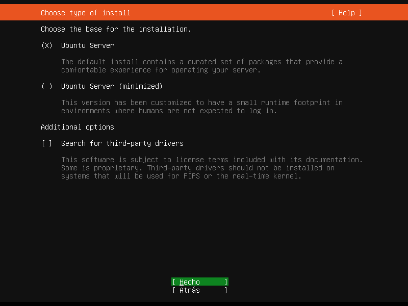
- **Paso 2:**
>Al estar en virtualbox la configuración de la máquina virtual en adaptador puente, nos coge una ip por defecto de la misma red local en la que se encuentra nuestro equipo.

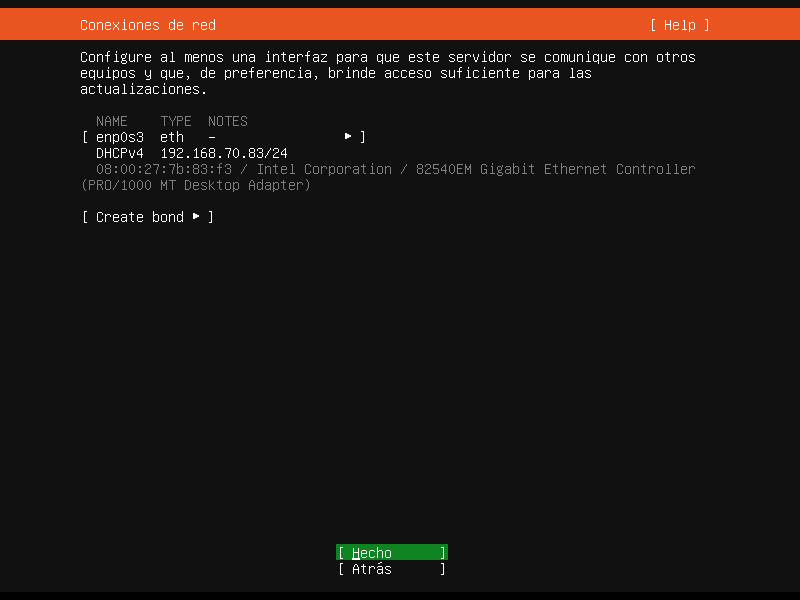
- **Paso 3:**
> Mirrors por si acaso no descarga del servidor principal.

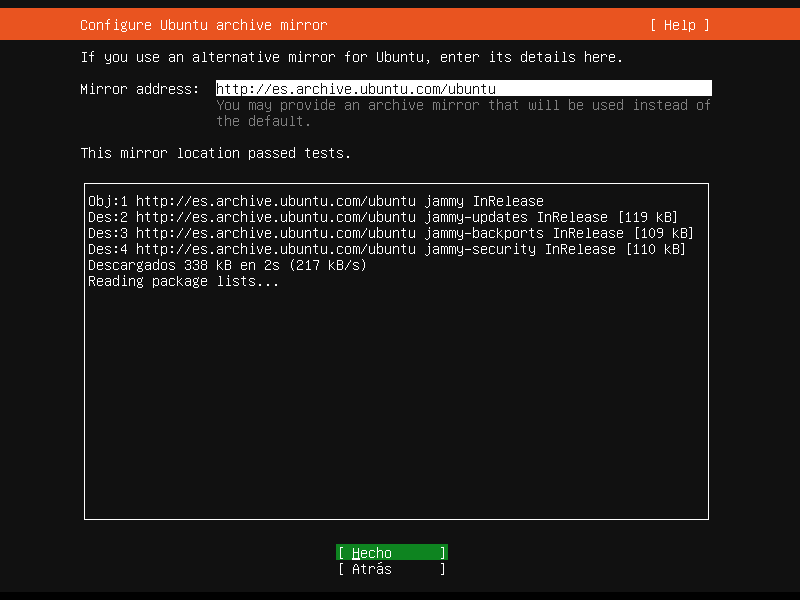
- **Paso 4:**
> Seleccionamos nuestro HDD por defecto.

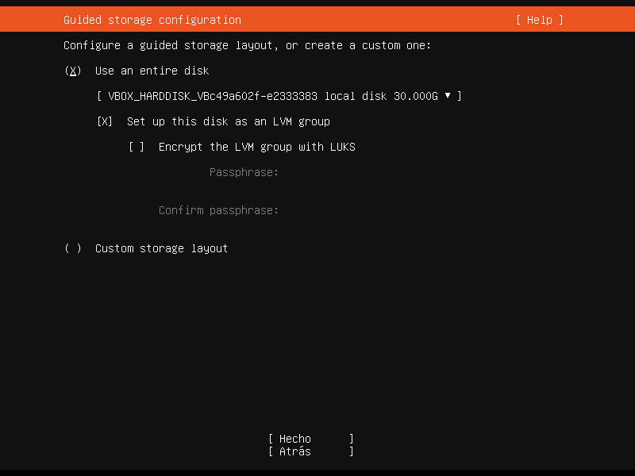

- **Paso 5:**
> Dejamos las particiones que ha creado por defecto.

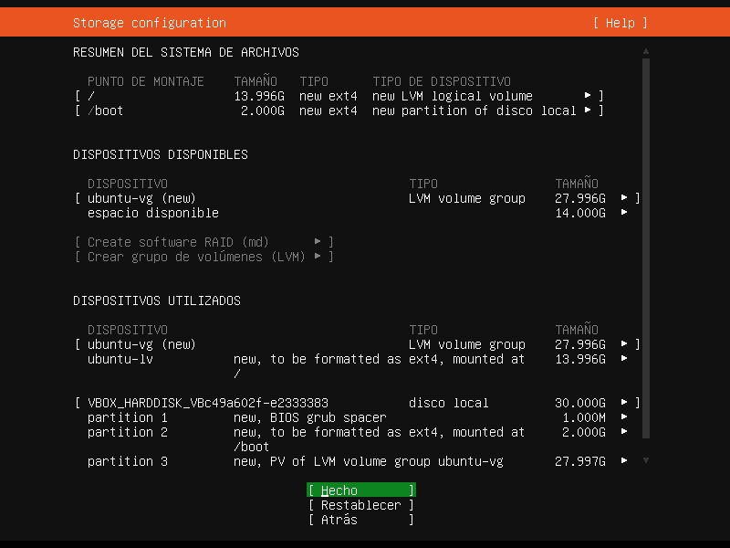

- **Paso 6:**
> Rellenamos los campos.

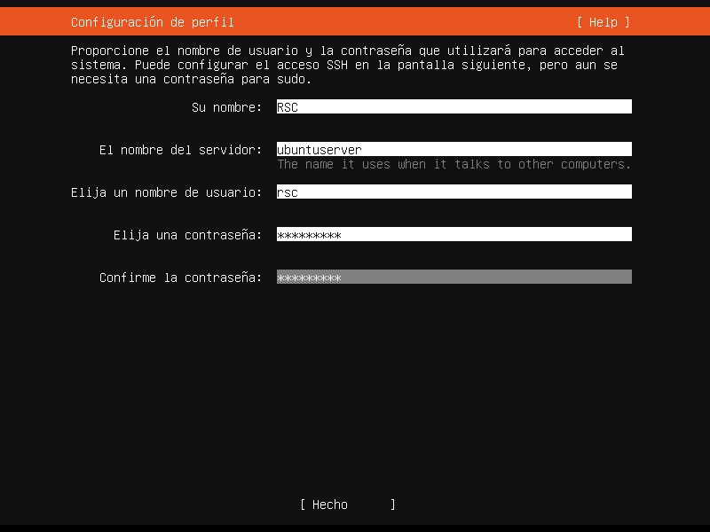

- **Paso 7:**
> Instalamos SSH para luego poder manejar nuestro servidor desde nuestra máquina mediante ssh.

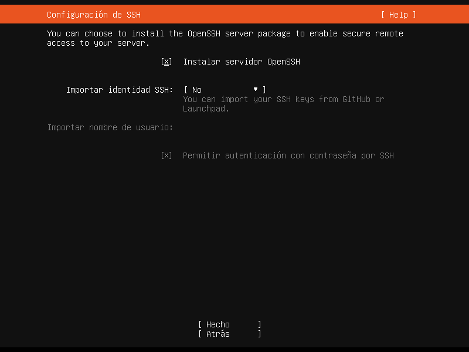

- **Paso 8:**
> Final de la instalación, con el ubuntu server iniciado.

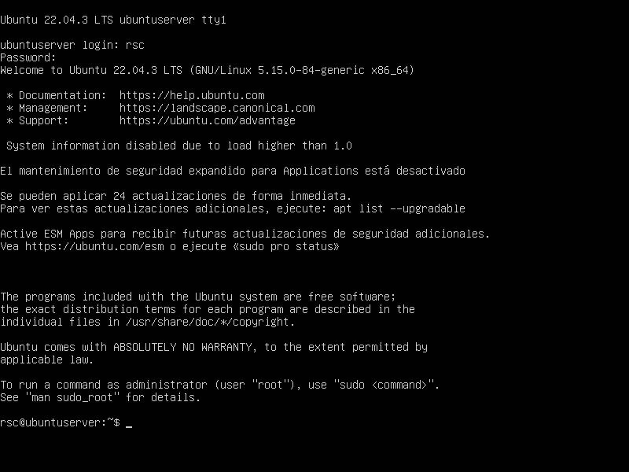

## 5) Investiga en la web para qué se utiliza la herramienta curl (puedes ejecutar man curl para obtener ayuda). Indica que es lo que hacen los siguientes comandos:

- **curl www.google.es:** Realiza una petición GET a la url de google, obteniendo los datos( mayormente el HTML y las cabeceras).
- **curl --request GET www.google.es**: Realiza la misma petición GET que el anterior, porque request es para HTTP, que es por defecto lo que hace la anterior.
- **curl -X GET www.google.es**: Tiene el mismo resultado que las anteriores. El -X se utiliza para establecer el método HTTP que se usará.
- **curl -X GET -I www.google.es**: Este solo hace petición de los datos de la cabecera, ya que el -I es equivalente a --head.
- **curl -X GET -i www.google.es**: Igual que los primeros, pero este incluye la cabecera por el -i

## 6) Dispones de máquinas que cuentan con el sistema operativo Ubuntu Server y Windows, tienen el entorno de red configurado y disponen de conexión a Internet. Además, se tiene acceso a la cuenta del usuario root o Administrador en cada caso. Indicar los pasos y comandos implicados para conseguir hacer lo siguiente (documentar el proceso de instalación y configuración).

**Paso 1:**
>Instalación Apache.

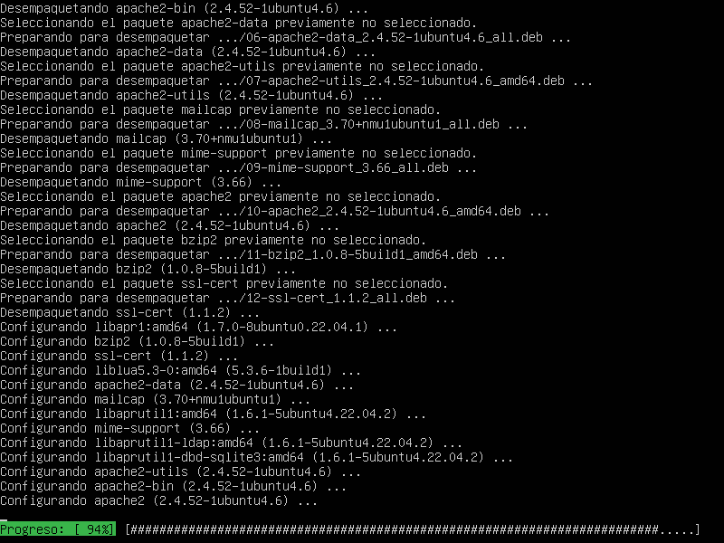

**Paso 2:**
>Comprobamos que el estado de apache esta OK.

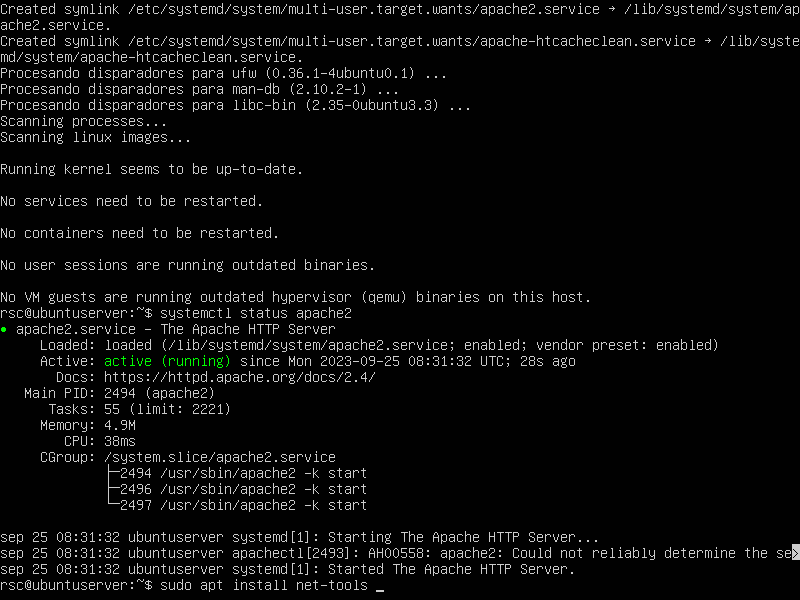

**Paso 3:**
> Comprobamos desde nuestra máquina si esta levantado el servidor, introduciendo nuestra ip del servidor ubuntu.

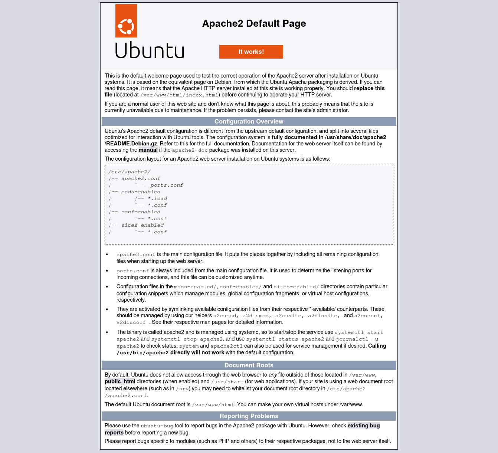

**Paso 4:**
> Concedemos permisos para no tener que estar usando sudo.

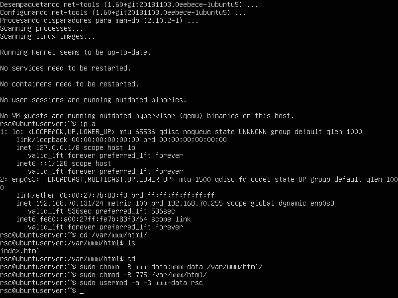

**Paso 5:**
>Creamos una web para probar el servidor.

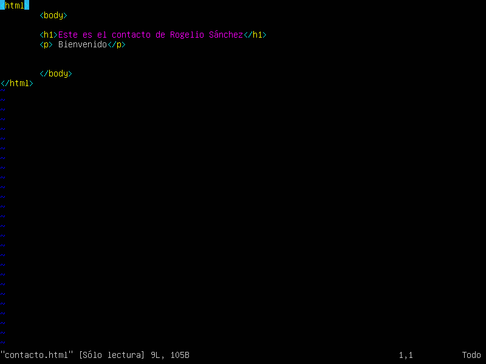

**Paso 6:**
> Probamos la web desde nuestra máquina  con la dirección ip del servidor.

**Paso 7:**
> Instalamos MariaDB, comprobamos que este OK

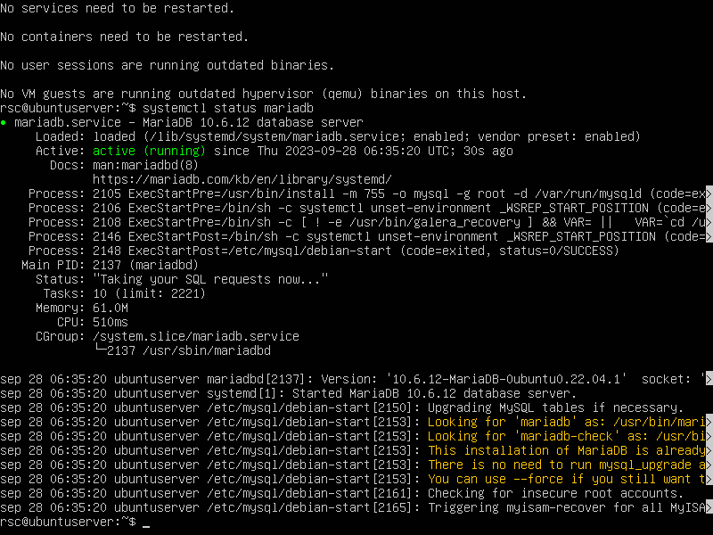

**Paso 8:**
>Instalamos php y comprobamos si esta instalad.

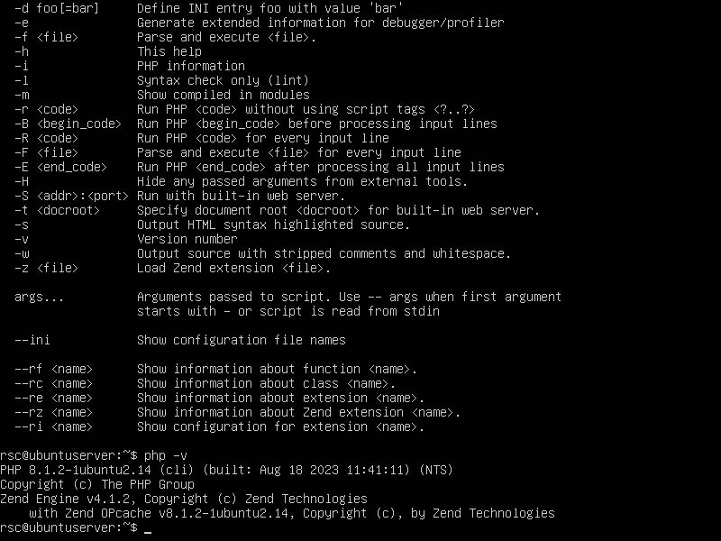

**Paso 9:**
>Creamos un script info.php y accedemos a el desde nuestro navegador

.png)

**Paso 10:**
>Instalamos phpadmin siguiendo los pasos y accedemos a el desde la dirección ip mas /phpmyadmin

**Paso 11:**
> Cambiamos el puerto del 80 al 81 para probar los puertos.

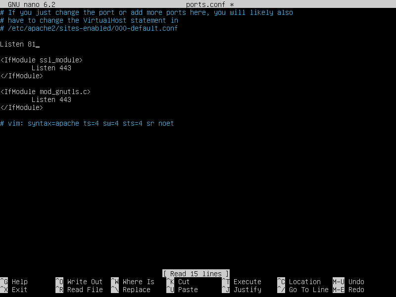