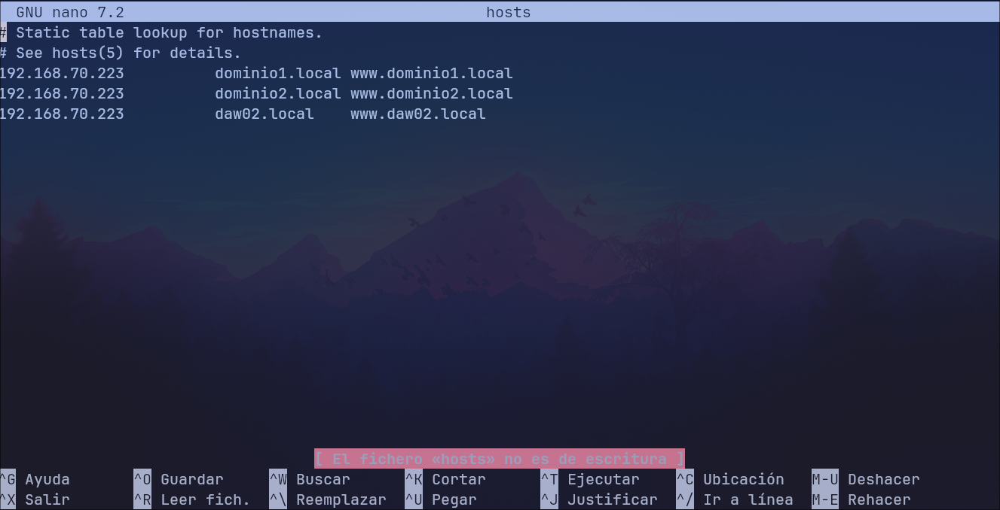
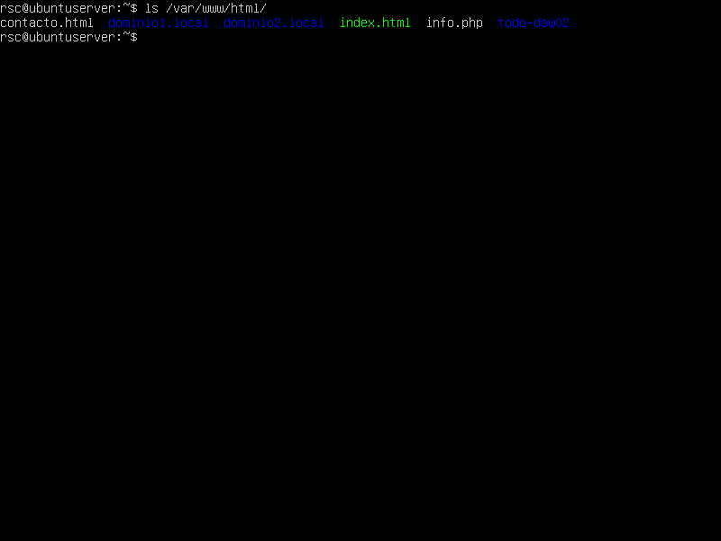
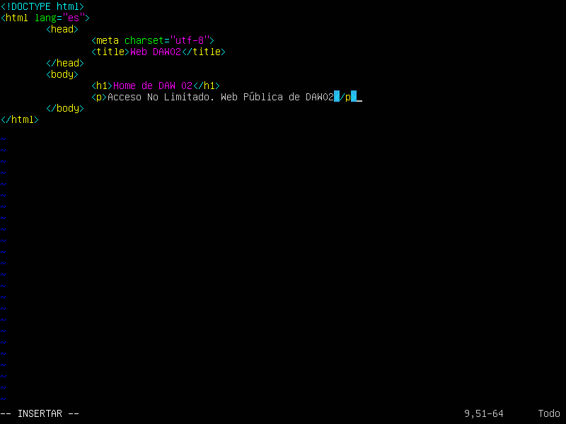
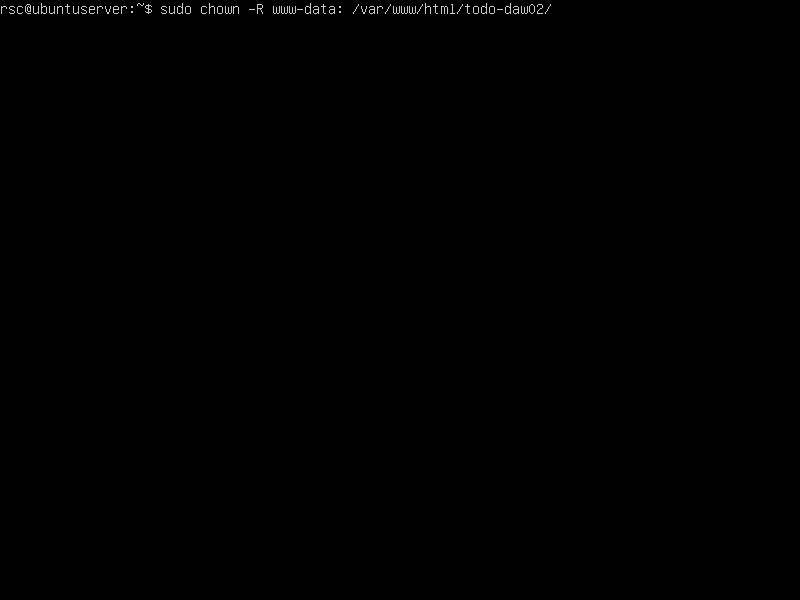
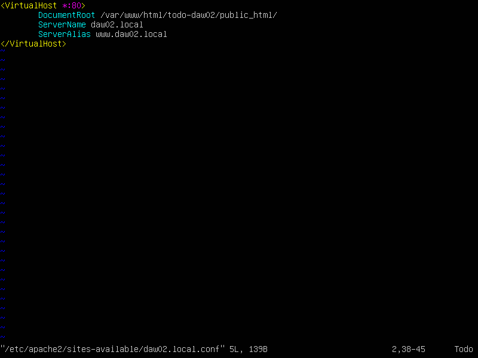
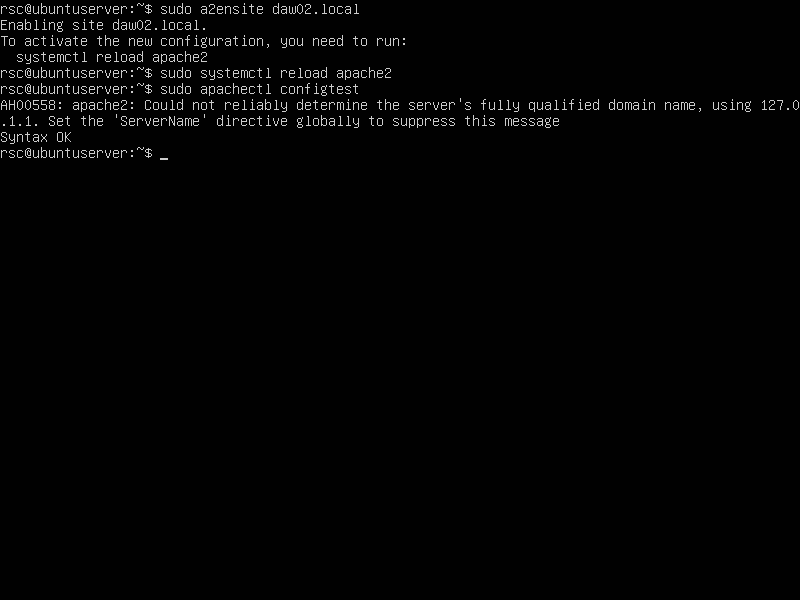
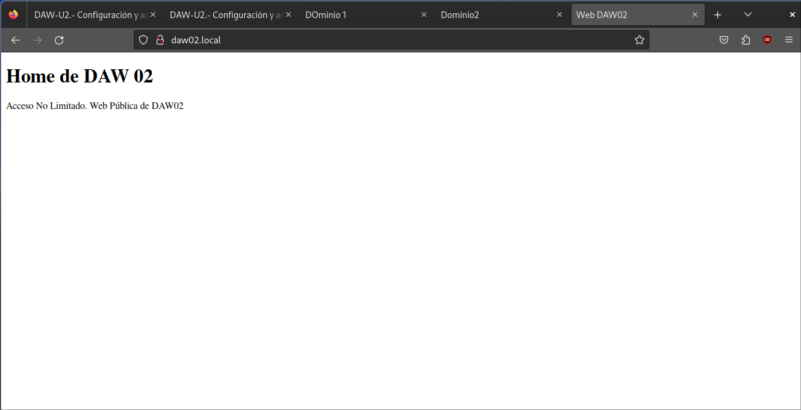

# Actividades Unidad 02

## 1.Configurar un host virtual basado en nombres denominado daw02 que permita el acceso a una página web localizada en el directorio todo-daw02. Hacerla accesible a través de las siguientes URL que identifican a la empresa: www.daw02.local y daw02.local.

**Paso 1:**

>Modificamos el host de nuestra máquina local

**Paso 2:**

>Creamos el directorio para daw02.local sudo mkdir -p /var/www/html/todo-daw02/public_html

**Paso 3:**

>Creamos el index.html para dicho dominio

**Paso 4:**

> Damos permisos al usuario www-data sudo chown -R www-data: /var/www/html/todo-daw02

**Paso 5:**

>Creamos el archivo de conf para el dominio sudo nano /etc/apache2/sites-available/daw02.local.conf

**Paso 6:**

> Habilitamos el sitio con  sudo a2ensite  y realizamos el configTest

**Paso 7:**

>Desde el navegador de nuestra máquina principal entramos a la dirección daw02.local

