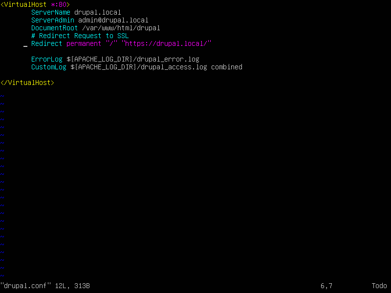
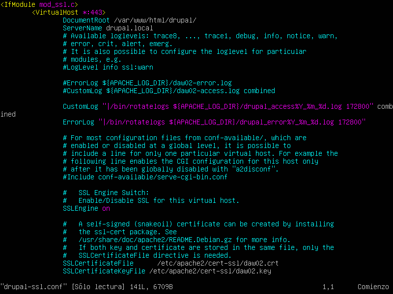
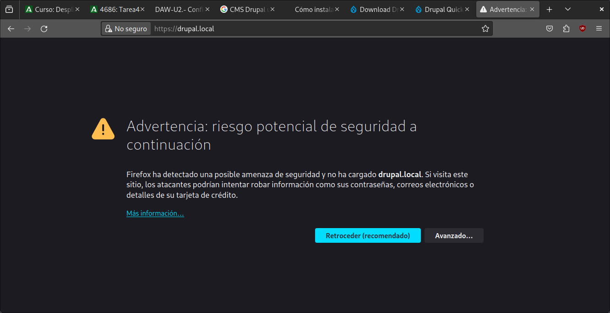
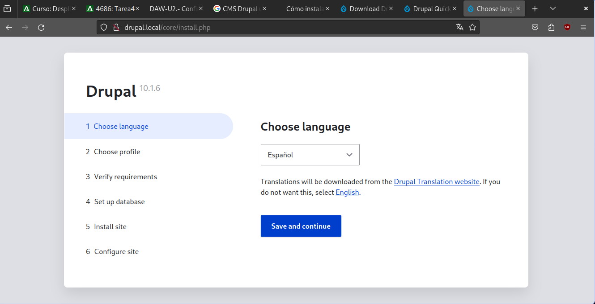
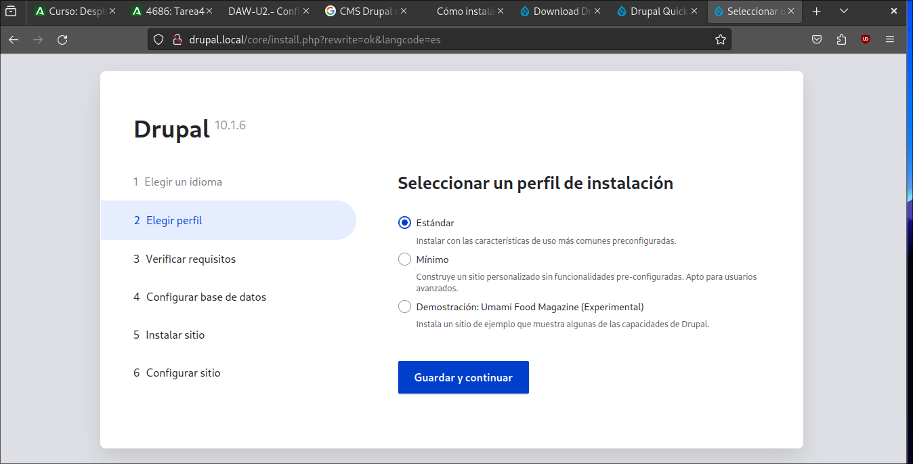
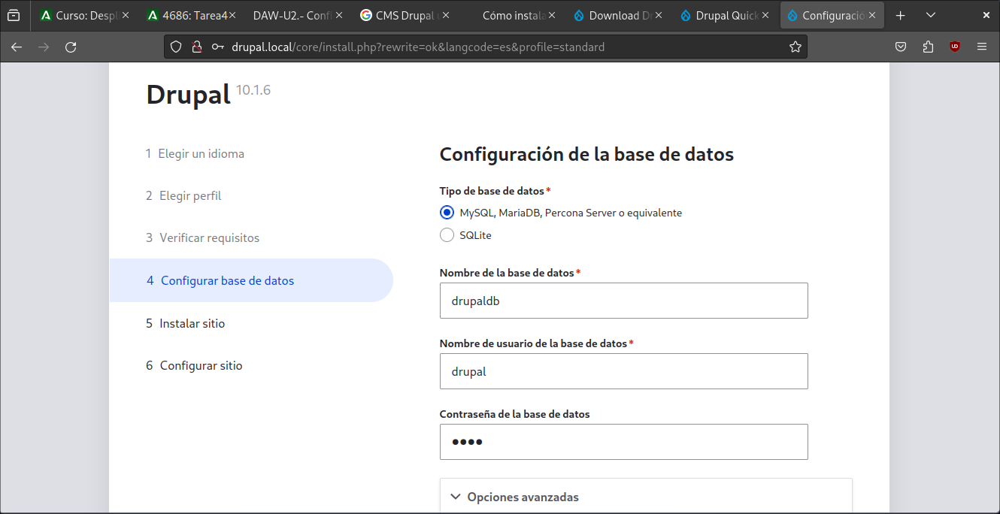
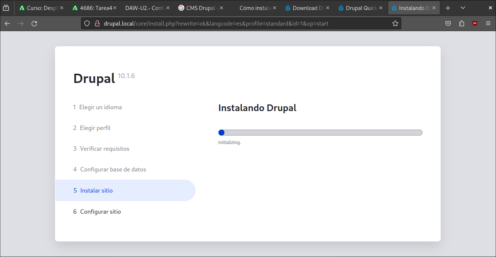
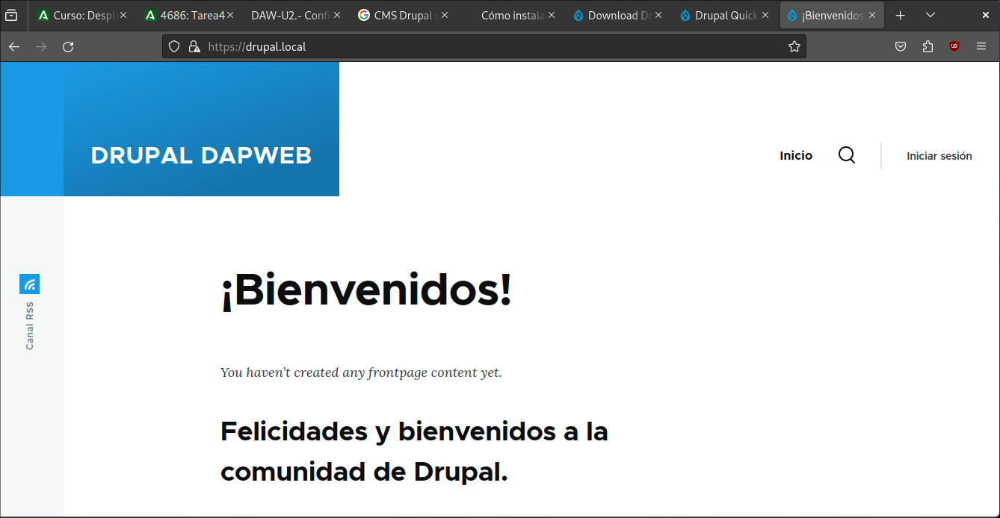

# Actividades.


## Realiza el despliegue del CMS Drupal como sitio seguro. Buscar información en la web sobre cómo realizar su despliegue


**Paso 1:**

>Abre el archivo sudo nano /etc/php/8.1/apache2/php.ini  y cambiamos los siguientes valores:
```bash
memory_limit = 512M
upload_max_filesize = 60M
max_execution_time = 300
date.timezone = Europe/Paris
```
> Y reiniciamos apache: `sudo systemctl restart apache2`

**Paso 2:**

>Descargamos la ultima versión de Drupal
```bash
wget https://www.drupal.org/download-latest/tar.gz -O drupal.tar.gz
```
>Extraemos con tar
```bash
tar -xvf drupal.tar.gz
mv drupal-* /var/www/drupal
```
>A continuación, cambia la propiedad y el permiso del directorio de instalación de Drupal`/var/www/drupal` utilizando el siguiente comando. La propiedad debe ser usuario y grupo `www-data` con el permiso de usuario normal`755`.

```bash
sudo chown -R www-data:www-data /var/www/drupal/
sudo chmod -R 755 /var/www/drupal/
```
>Ahora vamos al directorio  `/var/www/drupal` y ejecutamos el `composer`.
```bash
cd /var/www/drupal
sudo -u www-data composer install --no-dev
```

**Paso 3:**

> Ahora habilitamos algunos módulos necesarios
```bash
sudo a2enmod rewrite ssl headers deflate
```

**Paso 4:**

>Ahora creamos en `/etc/apache2/sites-available/` el archivo drupal.conf.



>Añadimos la linea de `Redirect permanent "/" "https://drupal.local/"` para que nos mande siempre al sitio seguro.

>Ahora cremamos el archivo drupal-ssl.conf




>Habilitamos los sitios y comprobamos la sintaxis
```bash
sudo a2ensite drupal.conf
sudo a2ensite drupal-ssl.conf
sudo apachectl configtest
```
>Por ultimo reiniciamos apache
```bash
sudo systemctl restart apache2
```

**Paso 5:**

>Antes de entrar al sitio para configurar, creamos la base de datos. Accedemos a mariadb

```bash
sudo mysql -u root -p
```

>Una vez dentro creamos la database y el usuario.

```sql
CREATE DATABASE drupaldb;
CREATE USER drupal@localhost IDENTIFIED BY 'password';
GRANT ALL ON drupaldb.* TO drupal@localhost WITH GRANT OPTION;
FLUSH PRIVILEGES;
```

**Paso 6:**

> Ahora accedemos a `drupal.local` y directamente nos metera en la https. Nos saldrá la instalación.













> Una vez instalado, nos mostrará la siguiente página:




