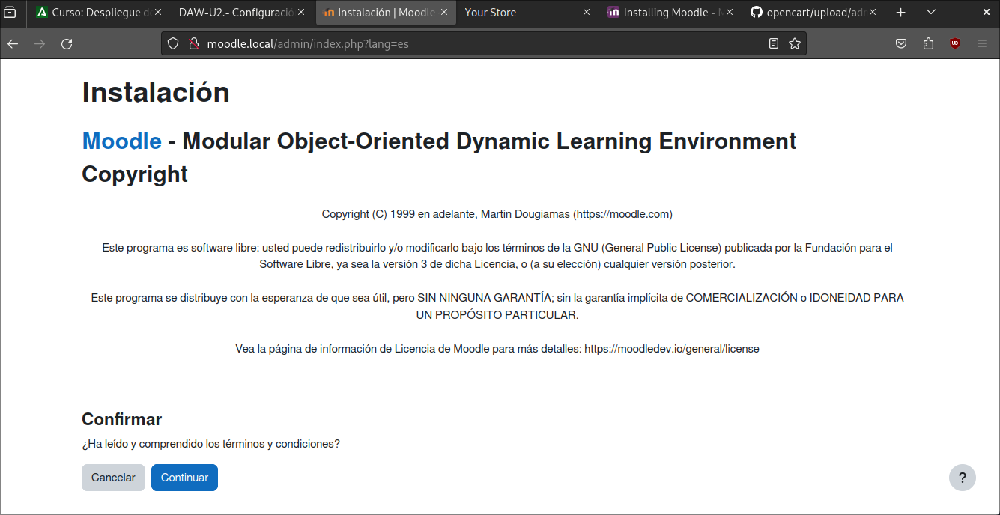

# Actividades.

## Desplegar las aplicaciones vistas en los puntos 8.2 y 8.3 (añadir acceso mediante HTTPS).

### MOODLE

**Paso 1:**

>Nos vamos a la documentación de Moodle y nos descargamos la version 4.3. Añadimos al archivo hosts la ip y dirección.

**Paso 2:**

>Creamos el archivo moodle. Reiniciamos apache, habilitamos el sitio y le damos permisos a los directorios.

**Paso 3:**

> Una vez todo habilitado, entramos en la direccion de tienda-virtual.conf y nos aparecerá la instalación de moodle.

**Paso 4:**

>Una vez instalado, faltaria crear el usuario y moodle.

### OPENCART

**Paso 1:**

>Clonamos el repositorio de Opencart. Añadimos al archivo HOSTS la ip y nombre de la página. Creamos el archivo .conf

**Paso 2:**

> Le damos los permisos al directorio, habilitamos el sitio, reiniciamos apache. Entramos en la dirección de tienda y nos aparecerá la instalación de OpenCart.

**Paso 3:**

>Instalamos siguiendo los pasos.

### Version con SSL de ambos sitios

**Paso 1:**

> En cada sitio, debemos cambiar la configuración de config.php y añadir a la dirección, la "s" a http.

## Desplegar Symfony tanto en Windows como en Ubuntu.

**Paso 1:**

> Modificamos el archivo php.ini con los parametros del pdf. Reiniciamos el apache2. Descargamos la última versión de Composer. Nos vamos a /var/www/html y descargamos symfony: `sudo composer create-project symfony/website-skeleton web`. Le damos permisos a los directorios. Creamos el archivo web-s5.local

**Paso 2:**

> Ya lo tendriamos instalado, entramos a la dirección y lo comprobamos

