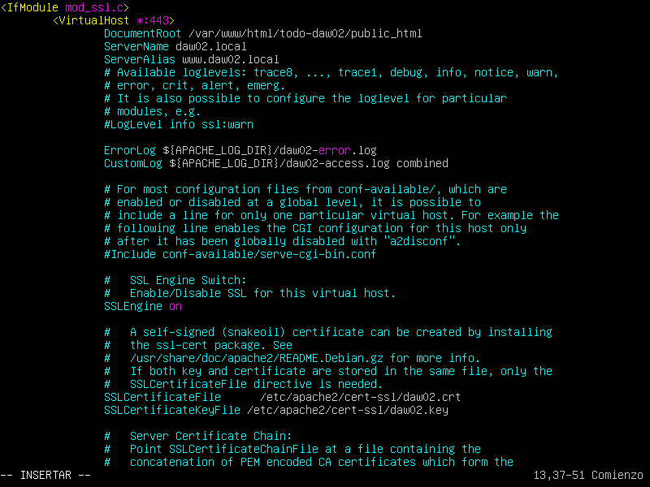

# Actividades.

## 2. Crear el subdirectorio todo-daw02/delimitado teniendo en cuenta que:
## ✓ El directorio todo-daw02 permite el acceso a cualquier usuario.
## ✓ El subdirectorio todo-daw02/delimitado permite el acceso solamente al usuario admin.

**Paso 1:**

> Crear los usuarios y password con htpassword

        

**Paso 2:**

> Añadir un nuevo directory al archivo daw02-ssl.conf

              

**Paso 3:**

> Comprobar con apachectl configtest si esta bien la sintaxis del archivo anterior

**Paso 4:**

> Le damos permisos a la nueva carpeta.

**Paso 5:**

> Entramos a la nueva web de delimitado

> Una vez hecho el login

## Configurar los archivos de registro como sigue:
## ✓ Identificación log de acceso: daw02-access.log.
## ✓ Identificación log de error: daw02-error.log.
## ✓ Alias logformat: combined

**Paso 1:**

> Añadimos los logs para daw02 en el archivo -ssl.conf del sitio y reiniciamos el apache.

**Paso 2:**

> Comprobamos que han sido creados.

**Paso 3:**

> Ahora vamos comprobando el log de access en tiempo real con tail -f.

**Paso 4:**

> Comprobamos el log de error en tiempo real con tail -f.

## 5. Rotar logs por intervalo temporal: cada 48 horas

**Paso 1:**

> Modificamos el -ssl.conf

**Paso 2:**:

> vemos los archivos creados nuevos.

