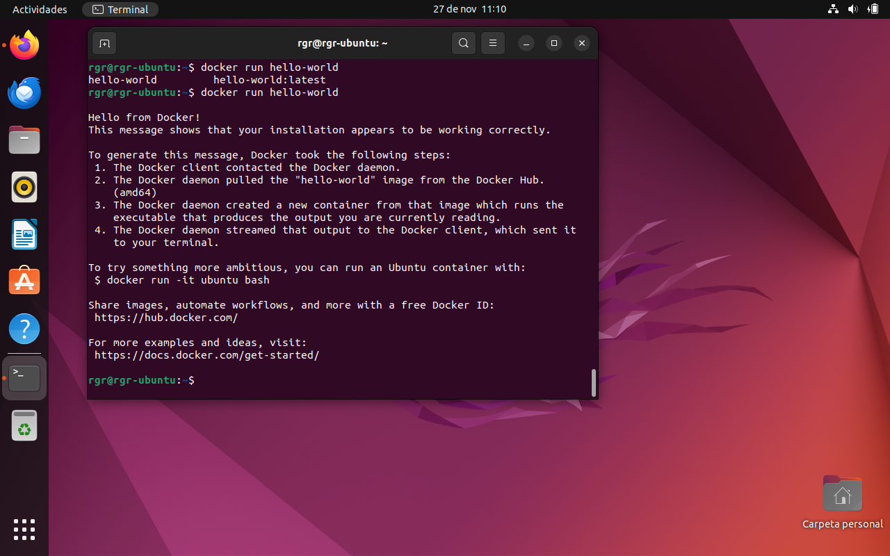

# Instalación Docker

## 1. Instala docker y una vez instalado haz una captura de pantalla en la que se muestre la versión de docker instalada, además esto deberá hacerse sin necesidad de ejecutar sudo. 

## 2. Ejecuta el contenedor de docker de Hola Mundo y realiza captura de pantalla (también sin sudo)

## 3. Crea una cuenta en docker hub y haz una captura de tu perfil

## 4. Crea un repositorio que se llame DAW2324 y haz una captura

##