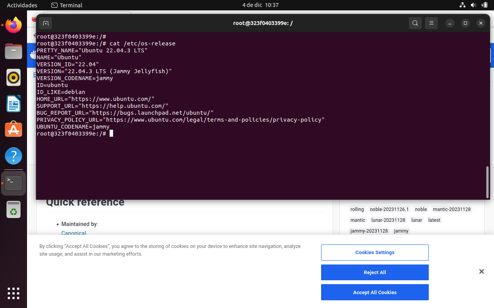
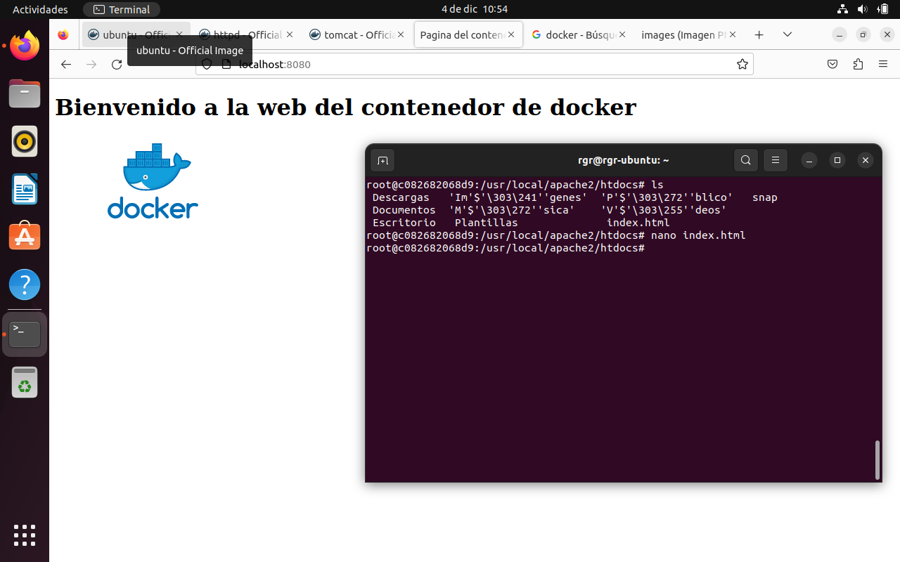
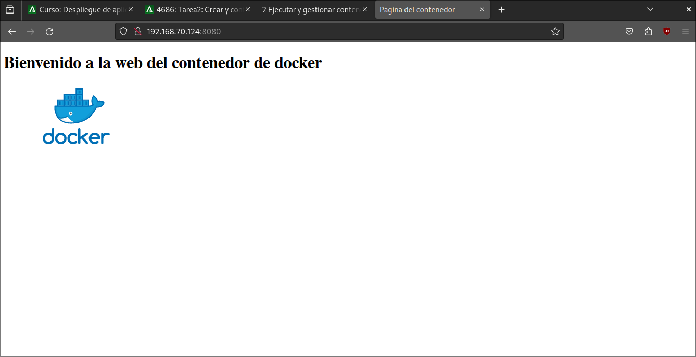
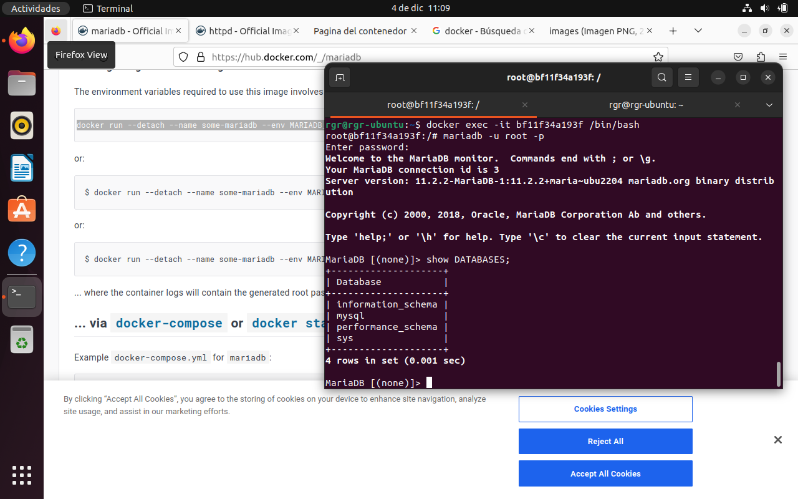
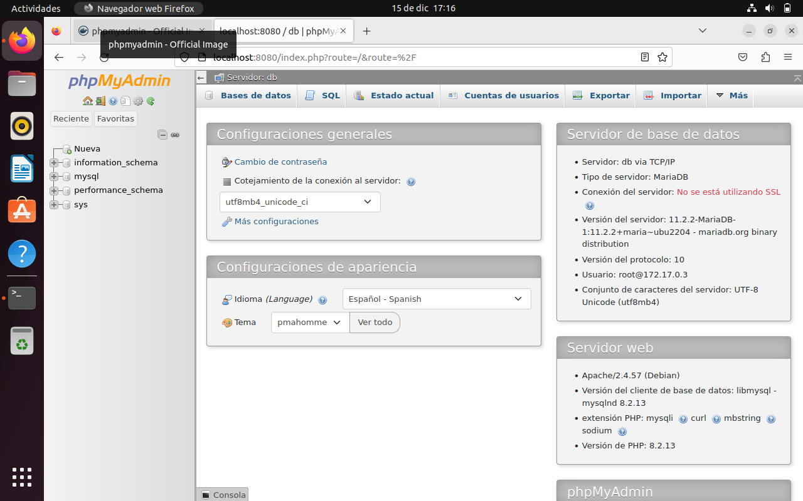
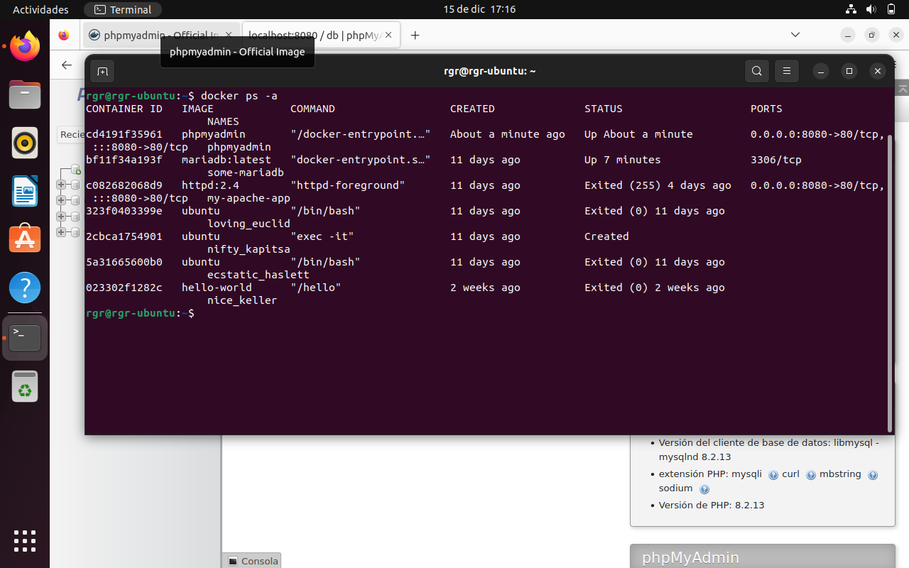

# Tarea2: Crear y configurar contenedores

## 1) Crea un contenedor de ubuntu accede a el con un terminal y muestra su archivo /etc/os-release

## 2) Busca un contenedor de apache con una estructura de directorios similar a la que hemos usado hasta ahora (etc/apache2/...) Crea un archivo html completo, que incluya la menos una imagen, en local súbelo al contenedor y visualízalo desde el navegador de la máquina virtual como el navegador de tu equipo.

## 3) Crea un contenedor mariadb, ejeculalo con un terminal y conéctate a el para mostrar las bases de datos de esta. Define la contraseña root para el acceso a la misma. 

## 4) Crea un contenedor de phpmyadmin y enlázalo al contenedor de mariaDB y accede a la BD desde el navegador (pista: link)

## Para terminar haz capturas mostrando los contenedores que tienes y las imágenes que tienes. 

