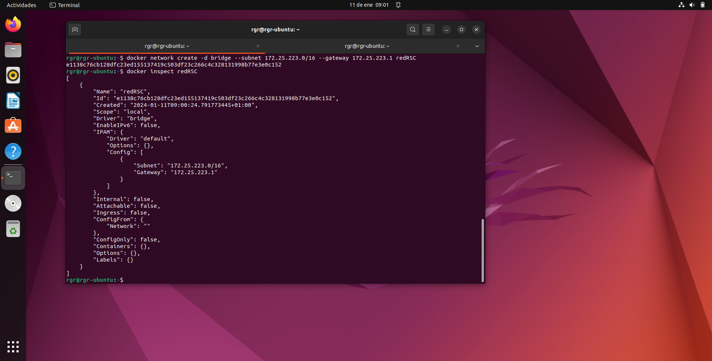
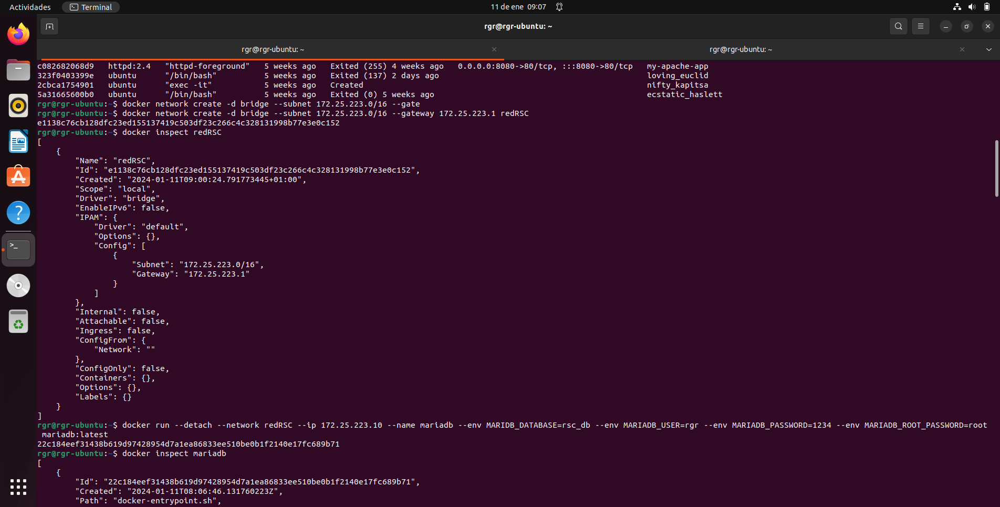
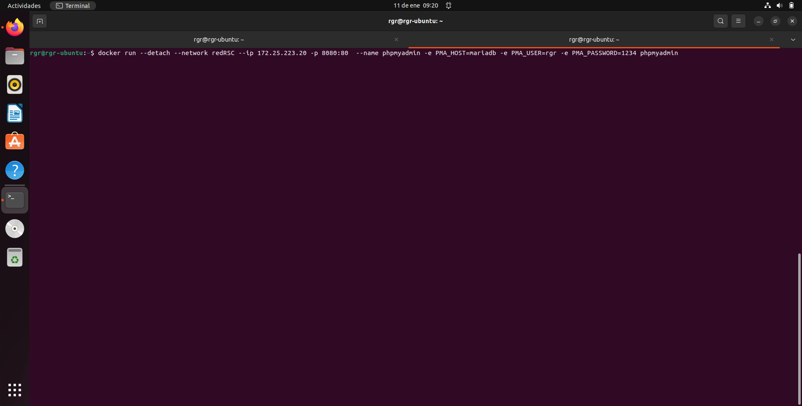
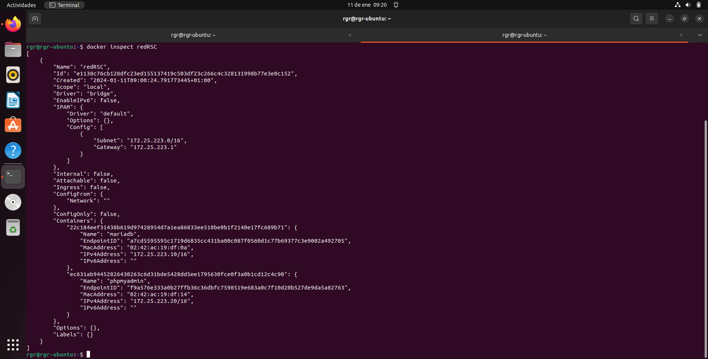
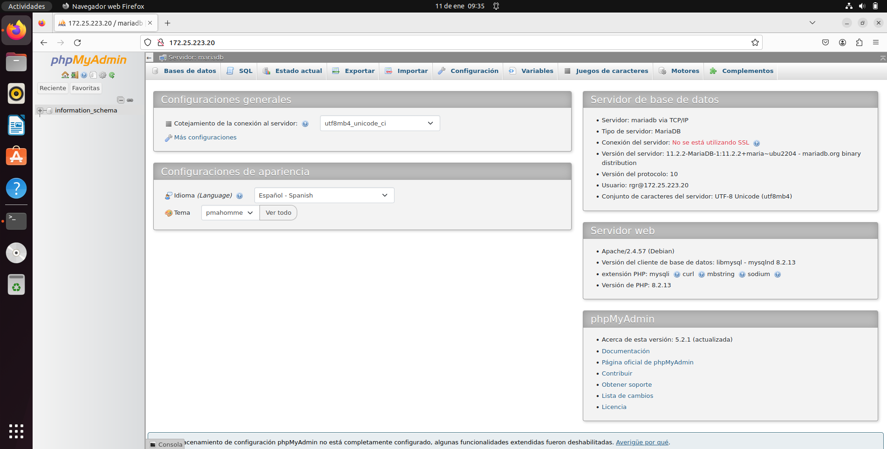

# Tarea 3 Configurar redes en docker

## Creación de una red en docker

Creamos la red con el siguiente comando:

```sh
docker network create -d bridge --subnet 172.25.223.0/16 --gateway 172.25.223.1 redRSC
```
Para comprobar que se ha creado correctamente, inspeccionamos la red.

```sh
docker inspect redRSC
```



## Creando el contenedor mariaDB.

Para crear el contenedor de mariaDB se le pasa el siguiente comando:

```sh
docker run --detach --network redRSC --ip 172.25.223.10 --name mariadb --env MARIDB_DATABASE=rsc_db --env MARIADB_USER=rgr --env MARIADB_PASSWORD=1234 --env MARIADB_ROOT_PASSWORD=root  mariadb:latest

```




## Creando el contenedor de phpmyadmin

Para dicho contenedor de phpmyadmin se le pasa el siguiente comando, donde en PMA_HOST se le pone el nombre del contenedor de mariadb y en PMA_USER y PMA_PASSWORD los datos proporcionados al crear el mariaDB:

```sh
docker run --detach --network redRSC --ip 172.25.223.20 -p 8080:80  --name phpmyadmin -e PMA_HOST=mariadb -e PMA_USER=rgr -e PMA_PASSWORD=1234 phpmyadmin
```




## Comprobación

Se comprueba que se han creado y añadido ambos contenedores a la red creada.

```sh
docker inspect redRSC
```




Ahora accedemos a phpmyadmin a traves de la dirección ip asignada a dicho contenedor.

