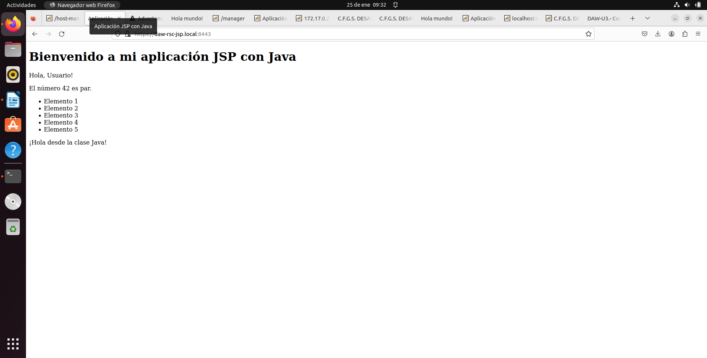
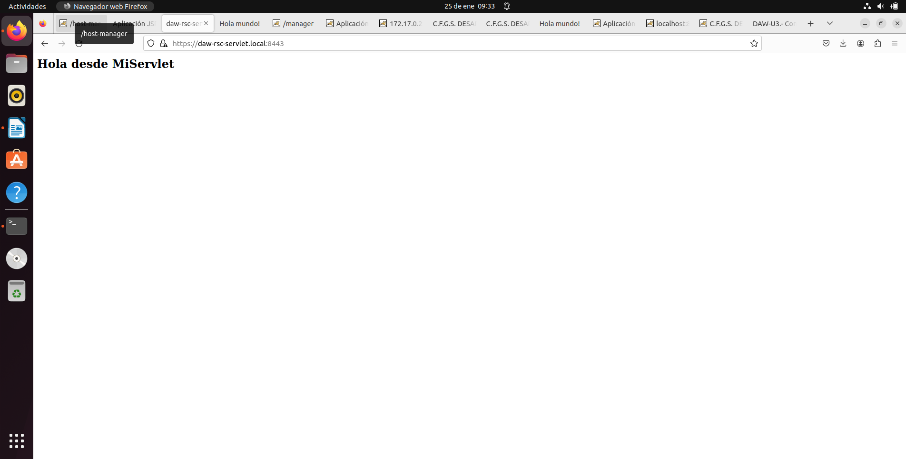

# Tarea 2 Configurar sitios virtuales y conexión ssl

## Captura del fichero server.xml donde se vea la definición de los host virtuales y la definición de la conexión segura en el puerto 8443.

> fichero con la definición de los hosts virtuales.

> captura con la conexión segura en el puerto 8443

## Captura del certificado ssl visualizado en el terminal con el comando keystore

> Captura con la información del certificado.

## Capturas de la conexiones seguras a esas aplicaciones a traves de su host virtual

>Capturas de la aplicación JSP.

> Capturas con la aplicación Servlet.

