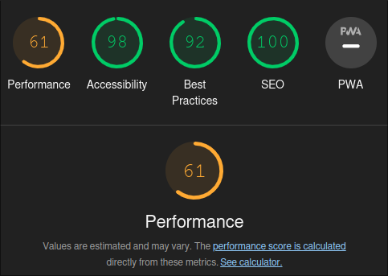
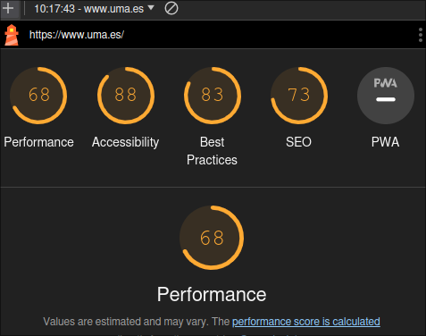

# Actividades Unidad 02

## 1. Haz una tabla donde se indique para el diseño de cada una de las páginas de la práctica de la unidad didáctica "Planificación de Interfaces gráficas", el tipo o tipos de discapacidad: visual, auditiva, cognitiva, motriz que habrá que tener en cuenta al analizar la accesibilidad de la web.

| Página | Discapacidad visual | Discapacidad auditiva | Discapacidad cognitiva | Discapacidad motriz |
|---|---|---|---|---|
| Principal | - Utilizar un contraste de colores adecuado para que los elementos sean visibles. | - Utilizar subtítulos o transcripciones para los vídeos y audios. | - Utilizar un lenguaje claro y sencillo, evitando tecnicismos y jerga. | - Utilizar elementos que permitan la navegación con el teclado. |

## 2. Investiga el porcentaje de la población española con los tipos de discapacidad estudiados y su  volución en los últimos años. También puedes buscar un análisis mundial.

Según la Encuesta de Discapacidad, Autonomía personal y situaciones de Dependencia (EDAD) 2020, el 6,7% de la población española tiene algún tipo de discapacidad. Esto supone un total de 2,8 millones de personas.

La discapacidad más común en España es la discapacidad física, que afecta al 42,0% de las personas con discapacidad. Le siguen la discapacidad auditiva (25,1%), la discapacidad visual (18,6%) y la discapacidad intelectual (14,3%).

Evolución de la discapacidad en España

El porcentaje de la población española con discapacidad ha aumentado ligeramente en los últimos años. En 2016, el porcentaje era del 6,5%.

Según la Organización Mundial de la Salud (OMS), el 15% de la población mundial tiene algún tipo de discapacidad. Esto supone un total de 1.200 millones de personas.

La discapacidad más común en el mundo es la discapacidad física, que afecta al 80% de las personas con discapacidad. Le siguen la discapacidad auditiva (20%), la discapacidad visual (10%) y la discapacidad intelectual (10%).

## 3. Realiza un estudio mediante validadores online sobre las diferentes web. ¿Cuál de ellas consideras que cumple mejor las pautas Accesibilidad Web? Indica para cada una de ellas el nivel de conformidad que crees que cumple

- Universidad de Granada. https://www.ugr.es/ :

- Universidad de Málaga. https://www.uma.es/ :

- Universidad de Sevilla. https://www.us.es/ :

