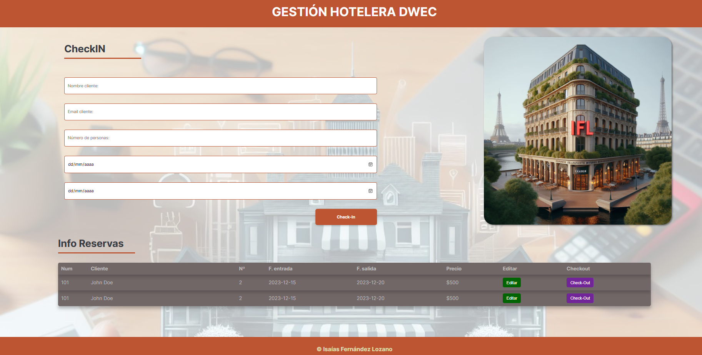

# Examen de Javascript Final DWEC

  

Dada la Estructura HTML que se proporciona se pide:

1. Montar un servidor local para gestionar los check-in de un hotel. Se debe de usar el fichero aportado `/server/db.json. 
**(0.25p)**

2. Crear un script llamado **"examen-dwec"** que permita iniciar mi servidor API y Vite a la vez.` 
 **(0.25p)**

3. Crea un componente llamado **`renderCheckin.js`** que permita pintar todos los `checkins` de mi API en filas **\<tr\>**. (He aportado el ejemplo de varias filas insertadas a mano. Recuerda eliminarlas.)
   1. Dichos elementos de la tabla han de crearse dinámicamente cargando los check-in desde nuestra Api a través de una función llamada **`getCheckin.js`** cada vez que accedamos a nuestra Web.
   2. Cada fila ha de tener los elementos que aparecen en la api(imagen), junto con los botones 'Editar' y 'Check-out'. 
**(1.5p)**

4. Disponemos de un formulario para realizar el Check-in de los clientes. Para ello a través de una función llamada **`saveCheckin`** almacenará en nuestra Api (checkin) el ingreso de un cliente a nuestro Hotel. La habitación asignada será **ALEATORIA** de las habitaciones disponibles (que no estén ya almacenadas en checkins). Se aplican las siguientes restricciones:
   1. Los campos no pueden estar vacíos.
   2. El número de personas por habitación es entre 1-4.
   3. La fecha de entrada no puede ser anterior al día de hoy.
   4. La fecha de salida debe ser posterior a la fecha de entrada.
   5. El precio_facturado (que se almacena en el End-Point checkins) ha de ser el producto del número de personas en la habitación por el precio de la habitación y por el número de días. Si el número de personas es 4, se aplica un 20% de descuento al precio_facturado. 
**(2.75p)**

5. Cuando pulsamos el botón de `Editar` un Check-In, La información de la fila pasará al formulario principal, permitiendo ser editada. Una vez modificados los datos, estos pasaran tanto a la Api, como a lo que se puede ver en el DOM usando una función llamada **`editCheckin.js`**.
**(2,5p)**

6. El botón `Check-Out` elimina la entrada(toda la fila) de la tabla y de nuestra Api en la zona _checkins_ y la almacena en la zona _checkouts_, quedando un historico de los Check-In en la zona de checkouts de la Api según van abandonando los clientes el hotel. Esto se realizará a través de una función llamada **`saveCheckout.js`** 
**(1.5p)**

7. Crear una función llamada **`cashiering.js`** que me haga un recuento de la caja realizada. Dicho recuento se hará de todos los checkouts almacenados en mi Api, mostrando por pantalla el número de CheckOut realizados y la caja (suma de todos los checkout) obtenida. Para probarlo, podéis añadir un botón y en la acción del click probar la función.
**(0,75p)**

8. Se deben de **documentar** algunos de los **componentes** y algunas de las **funciones** que estéis utilizando.
**(0.25p)**

9. El archivo **main.js** debe de estar **documentado** con vuestros datos.
**(0.25p)**

10. Se debe de entregar el examen **comprimido en zip** pero eliminando la carpeta **node_modules**.
11. Esta prueba evalúa todos los RA de este primer trimestre.
12. La duración de la prueba será de 3,5 horas.

### Previsualización Web

  

> Nota: Se pueden realizar modificaciones de propiedades al código suministrado si lo considerais necesario.
