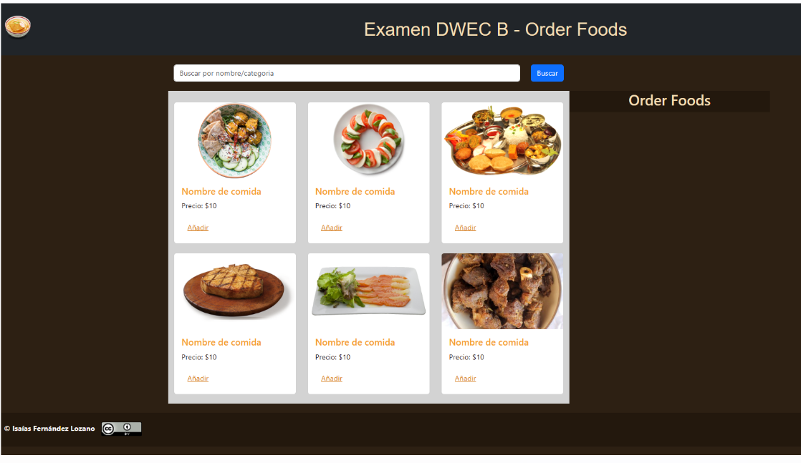

# Examen de Javascript Final DWEC Aula Bilíngüe

  

Dada la Estructura HTML que se proporciona se pide:

1. Montar un servidor local para acceder a los productos de un restaurante. Se debe de usar el fichero aportado `/server/db.json. 
**(0.25p)**

2. Crear un script llamado **"examen-dwec"** que permita iniciar mi servidor API y Vite a la vez.` 
 **(0.25p)**

3. Crea un componente llamado **`renderCardFoods`** que permita pintar las todos los productos de mi API usando las card de bootstrap. He aportado el ejemplo de 6 card.
   1. Dichas cards se deben de crear dinámicamente al iniciar a través de una función llamada **`getFoodsApi.js`** cada vez que accedamos a nuestra Web. (Por favor, borrar las card introducidas por mi en el fichero index.html, sólo son de prueba para que veáis como quedarían)
   2. Cada card ha de tener: una **imagen**, **nombre de la comida**, **precio** y una breve **descripción**. También tiene un **enlace** para añadir dicha comida a nuestro order. 
**(1.5p)**

4. Cuando pulsamos en `Añadir`, dicha comida se añade al Order Foods,
   1. La tarjeta ha de quedar difuminada para indicar que ya ha sido añadida. 
 **(0.25p)** 

   2. Crear un componente **`renderCardOrder`** para pintar la comida añadida a la zona de "Order Foods". Dicho componente ha de tener una **pequeña imagen** de nuestra comida, el **nombre de la comida**, **precio** y un botón de **quitar** del Order. La información la debe de coger lógicamente de nuestra API 
 **(1.5p)** 

   3. Si quitamos una comida del Order, pulsando el botón de quitar, desaparecerá de esta zona y también automáticamente dejará de estar difuninada la card correspondiente, pudiéndose de nuevo insertar al Order.
**(0,25p)**

5. La zona de orders ha de tener un cómputo del total a pagar. Ha de aparecer un botón con el texto Pagar 💵 . Al pulsar en el botón pagar, se almacenará en el localStorage un estracto de la compra realizada bajo la clave de _"OrderFoods"_ 
**(1.5p)**

6. Además, cuando pulsemos en pagar, además de en el localStorage, se debe de añadir la compra a nuestra APi en el End-point **`Order`** usando una función llamada **`saveOrderApi.js`**. _Dejo a tu elección_ la forma y los datos que se deben de quedar registrados en la api el pedido/order. Una vez realizado el almacenamiento en el localStorage y en la API, se volverá a llamar a la página, quedando limpias todas las selecciones y el Order vacío. 
**(2p)**

7. La página web tiene un _buscador_ que permite buscar por nombre de comida o por categoría. Dicha información se ve filtrada al pulsar el botón de buscar. Para ello hay que realizar una función llamada **`findFoodsApi.js`** que realice la búsqueda. 
**(1p)**

8. La pulsación de la tecla escape o si buscamos sin escribir nada, me volverá a mostrar todos los productos disponibles.
**(1p)**

9. Se deben de **documentar** algunos de los **componentes** y algunas de las **funciones** que estéis utilizando.
**(0.25p)**

10. El archivo **main.js** debe de estar **documentado** con vuestros datos.
**(0.25p)**

11. Se debe de entregar el examen **comprimido en zip** pero eliminando la carpeta **node_modules**.
12. Esta prueba evalúa todos los RA de este primer trimestre.
13. La duración de la prueba será de 3 horas.

### Previsualización Web

  

