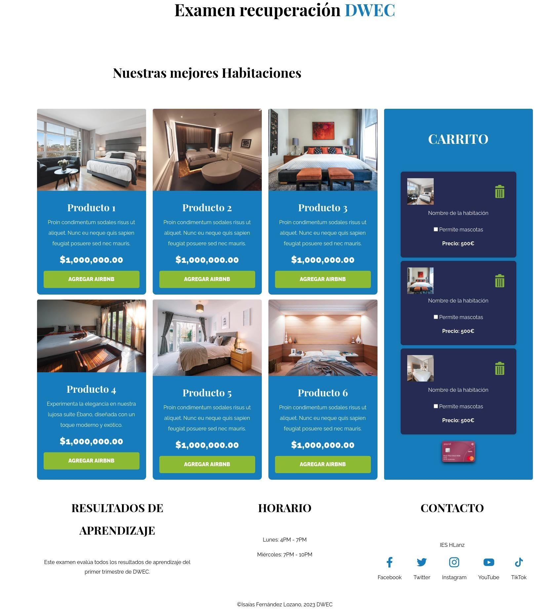

# Examen Recuperación de Javascript DWEC

  

Dada la Estructura HTML que se proporciona se pide:

1. Montar un servidor local para gestionar un Airbnb con una Api local. Se debe de usar el fichero aportado `/server/db.json. 
**(0.25p)**

2. Crear un script llamado **"examen-recuperacion"** que permita iniciar mi servidor API y Vite a la vez. 
 **(0.25p)**

3. Crea un componente llamado **`renderCardAirbnb.js`** que permita pintar todas las `tarjetas Airbnb` de mi API en DIV usando el endpoint `habitaciones`. (He aportado el ejemplo de 6 tarjetas creadas a mano. Recuerda eliminarlas.)
   1. Las tarjetas han de mostrar el nombre de la habitación.
   2. Una descripción del Airbnb.
   3. El precio del Airbnb
   4. El Botón Añadir Airbnb para añadir al carrito Airbnb.
**(1.5p)**

4. Al hacer click sobre la imagen de la habitación, quitaremos todo lo que aparece debajo de la imagen, para mostrar ahora:
   1. Los detalles de la habitación.
   2. Los servicios de que dispone.**Cada** servicio debe ir en un `<li>` **Obligatoriamente**.
   3. Si el Airbnb acepta mascotas o no.
   4. La dirección del Airbnb.
   5. Al volver a hacer click, aparece la información de partida.
   6. Este apartado se realizará usando una función llamada **`showInfo.js`** 
**(1.5p)**

5. Al pulsar en `Agregar Airbnb`, añadiremos una pequeña tarjeta a la zona del carrito, donde se mostrará:
   1. Imagen pequeña del airbn seleccionado.
   2. Nombre de la habitación.
   3. Si la habitación permite mascotas, un check para añadir o no ese servicio a nuestra habitación. Si la habitación no tiene mascotas este item no aparecerá.
   4. Precio de la habitación. El añadir mascotas con un click aumentará automáticamente un 20% el precio de la habitación, viendose reflejado.
   5. Un icono de basura, para quitar este Airbnb del carrito.
   6. La tarjeta que acabo de pulsar ahora aparecerá difuminada para indicar que he realizado la selección de dicha tarjeta.
   7. Todo este apartado se debe de realizar usando una función llamada **`addAirbnb.js`**
**(2.25p)**

6. En la parte inferior del carrito aparecerá una imagen `img/pay_card.jpg` de una tarjeta de crédito, que hará las funciones de botón y que al pulsarla facturará (sumará) los Airbnb que tengamos en el carrito. Dicha información pasará a un End-Point de mi carrito llamado carrito. Por tanto cada entrada el endpoint carrito tendrá una compra realizada con todas las habitaciones que hay seleccionado. Finalizado el proceso mostraremos un mensaje(alert) de tarea completada y volveremos a cargar la página para comenzar de nuevo. Este apartado se debe de realizar usando una función llamada **`saveAirbnb.js`**.
**(2.25p)**

7. Crear las siguientes funciones:
   1. Función **`getRoomByPrice`** que pase como parámetro `luxury` o `basic` y obtenga la información de aquella habitación más barata o más cara.
   2. Función **`getRoomByService`** que le pase como parámetro el nombre de algún `servicio` y automáticamente me muestre la información de todas aquellas habitaciones que posean el servicio buscado.
**(1.5p)**

8. Se deben de **documentar** algunos de los **componentes** y algunas de las **funciones** que estéis utilizando.
**(0.25p)**

9. El archivo **main.js** debe de estar **documentado** con vuestros datos.
**(0.25p)**

10. Se debe de entregar el examen **comprimido en zip** pero eliminando la carpeta **node_modules**.
11. Esta prueba evalúa todos los RA de este primer trimestre.
12. La carpeta **`img`** contiene todas las imágenes necesarias para esta prueba.
13. La duración de la prueba será de 3 horas.

### Previsualización Web

  
   

> Nota: Se pueden realizar modificaciones de propiedades al código suministrado si lo considerais necesario.
