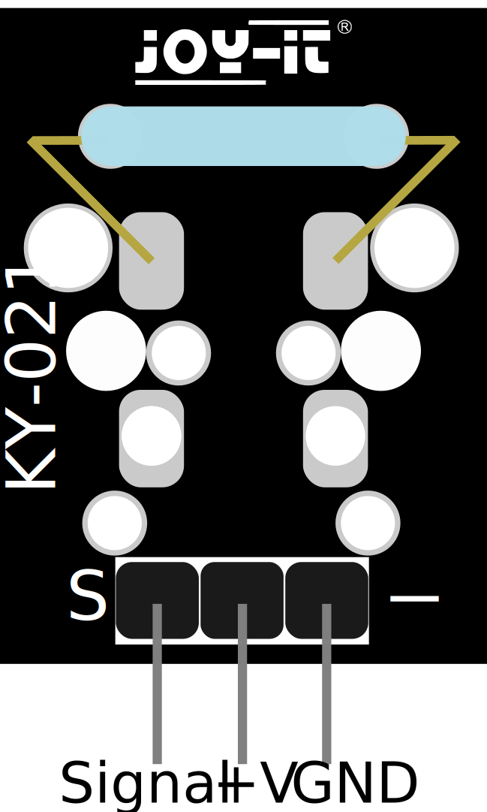

# **Sensor KY-021 MINI REED-MAGNET.**


<center>  </center>

>Si se detecta un campo magnético, las dos clavijas de entrada se cortocircuitan tirando de ellas una hacia la otra.


## **Datos Técnicos.**

| Voltaje de funcionamiento |   Dimensiones   |
| :----------------------: | :--------------: |
|    3,3 V - 5V       🔌   | 19 x 18,5 x 9 mm |


## **Asignación de pines en Raspberry PI.**
<br>

<center> </center>

<center></center>
<style>
    .heatMap {
        width: 100%;
        text-align: center;
        display:flex;
        justify-content: center;
        align-items:center;
        margin-top: 6rem;
        padding:2rem;
    }
    .heatMap th {
        background: grey;
        text-align: center;
        width: 200px;
    }
    .heatMap tr:nth-child(1) { background: red; }
    .heatMap tr:nth-child(2) { background: orange; }
    .heatMap tr:nth-child(3) { background: green; }
</style>
<div class="heatMap">


|    RASPBERRY PI     |   SENSOR          |
| :-----------------: | :--------------:  |
| GPIO 24 [Pin 18]     |       Signal      |
| 3.3 V [Pin 1]        |         +V         |
|   GND [Pin 6]        |        GND       |

</div>


<br>


<center>

### **Script python para el sensor.**

</center>


```python
# Se importan y configuran los módulos necesarios
import RPi.GPIO as GPIO
import time
   
GPIO.setmode(GPIO.BCM)
   
# Aquí se declara el pin de entrada, al que se conecta el sensor. Adicionalmente se activará la resistencia PullUP en la entrada
GPIO_PIN = 24
GPIO.setup(GPIO_PIN, GPIO.IN)
   
print("Sensor test [press CTRL+C to end test]")
   
# Esta outputFunction se ejecutará al detectar la señal
def outputFunction(null):
        print("Signal detected")
   
# Cuando se detecta una señal (flanco de señal descendente) se ejecuta la función de salida
GPIO.add_event_detect(GPIO_PIN, GPIO.FALLING, callback=outputFunction, bouncetime=100) 
   
# bucle principal del programa
try:
    while True:
        time.sleep(1)
   
# limpiar una vez finalizado el programa
except KeyboardInterrupt:
    GPIO.cleanup()
```

### **Video Script y sensor en funcionamiento.**


[Link Descarga video](https://mega.nz/file/cNQhEBTT#x-qz-qe5nb3SyWHWfa5lwkm_zgQ5VhqoTktHaB8A_pw)


<br><br><br><br><br><br><br><br><br><br><br><br>
<br><br><br><br>

## **Instalación Docker Home Assistant**

**Creamos el docker de Home Assistant con el siguiente comando:**

```sh
docker run --name=homeassistant -d \
  -v /ruta/a/tu/configuracion:/config \
  -v /ruta/a/tus/datos:/data \
  -p 8123:8123 \
  homeassistant/home-assistant

```
**En `-v /ruta/a/tu/configuracion:/config \` lo cambiamos por la ruta donde hayamos creado la carpeta configuración, en mi caso `home/roger/Documentos/homeassistant/configuration`.**

**En `-v /ruta/a/tus/datos:/data` lo cambiamos por datos, `home/roger/Documentos/homeassistant/datos`.**


**Ahora nos conectamos a Home Assistant con la IP de `localhost:8123`.**


**Creamos una cuenta.**


**Y nos entrará en la principal**

